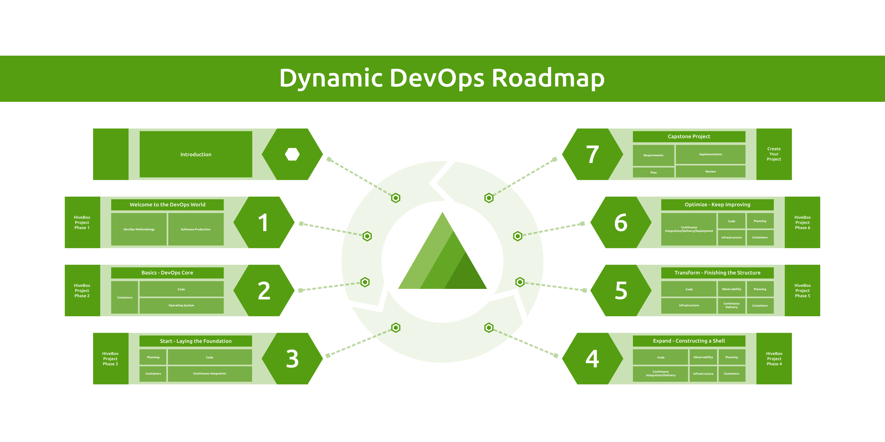

<!-- omit from toc -->
# Dynamic DevOps Roadmap

  

A **FREE** master plan to kickstart your DevOps Engineer career in the Cloud Native era following the Agile MVP style!

- Visit 
if you are interested in the DevOps hands-on project only.
- Join  for discussions and to stay updated.

<!-- omit from toc -->
## Give it a Star! ⭐

If you like this project, please [give it a star](#top) for better visibility. Thanks!

<!-- omit from toc -->
## Table of Contents

- [Status](#status)
- [Frequently Asked Questions](#frequently-asked-questions)
- [The Problem](#the-problem)
- [The Solution](#the-solution)
- [The Roadmap](#the-roadmap)
- [Star History](#star-history)
- [License](#license)

## Status

Please note that this repo is still a work in progress.

- **[Roadmap Content](https://devopsroadmap.io/getting-started/)**: 100%
- **[Hands-on Project](https://devopsroadmap.io/projects/hivebox/)**: 100%
- **[Interview Questions](https://devopsroadmap.io/category/interview)**: 0%
- **[Advanced Topics](https://devopsroadmap.io/category/growth)**: 0%

## Frequently Asked Questions

It's highly recommended to read the [FAQ page](https://devopsroadmap.io/faq/) before starting with roadmap.

## The Problem

  
   
  A subset of the Cloud Native landscape in December 2023 (click for the full landscape)

The `DevOps Engineer` role remains one of the top 10 most in-demand jobs across all industries (not just the tech field!). However, starting that role is super challenging because the DevOps model has various patterns and topologies. Also, the Cloud Native landscape keeps expanding, and there is something new every day!

Simply, **you cannot start a DevOps position by merely learning the tools!** It's even more complicated if that's your first job without previous software industry experience (coming from either Dev or Ops). Also following `linear` roadmaps like [roadmap.sh/devops](https://roadmap.sh/devops) cannot help to land your first job and probably will struggle a lot when you find one!

For more details about the problem aspects, please read: [What is the problem this roadmap is trying to solve](https://devopsroadmap.io/faq/)

## The Solution

  

Using a `MVP-style roadmap` with hands-on projects has been highly successful.

That means **first, understanding the problem instead of just learning a bunch of tools** and then **using an iterative style, each iteration will cover most DevOps areas used in the job** to build a T-shaped skills profile from day one!

For more details, check the next section.

## The Roadmap

This roadmap is `polymorphic`, which means it's designed to work in different modes. It depends on how fast you want to go (roadmap, mentorship, or bootcamp).

---

  

---

  

## Star History

  

## License

Dynamic DevOps Roadmap by [DevOps Hive](https://devopshive.net/) and under the open-source license, [Creative Commons  Attribution-ShareAlike 4.0 International](https://creativecommons.org/licenses/by-sa/4.0/). For more details, please review [LICENSE](LICENSE).
