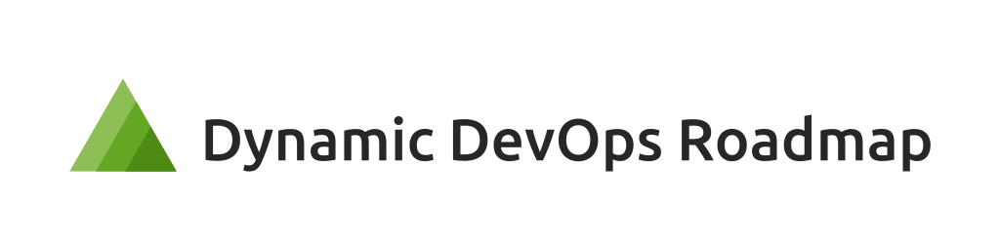
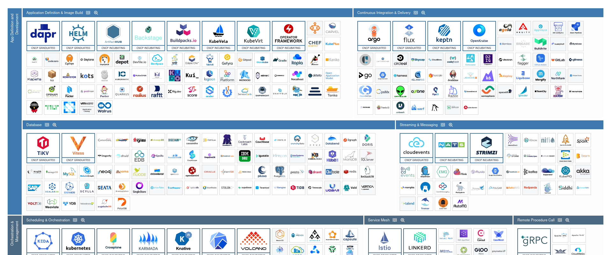
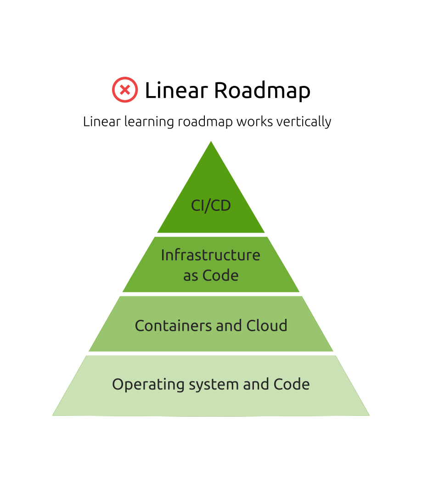
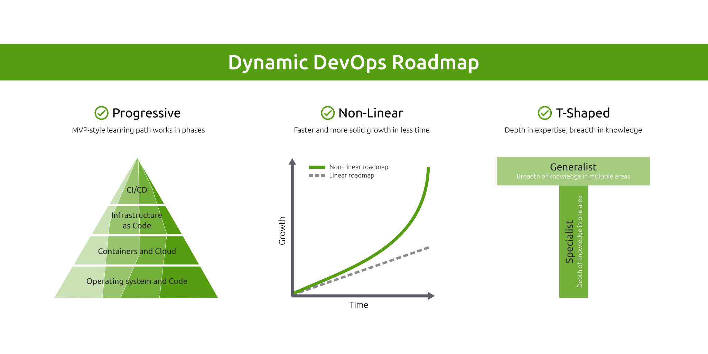

<!-- omit from toc -->
# Dynamic DevOps Roadmap

  

[🌐 Website](https://devopsroadmap.io/)
&nbsp;&nbsp;•&nbsp;&nbsp;
[✉️ Community](https://newsletter.devopsroadmap.io/subscribe)
&nbsp;&nbsp;•&nbsp;&nbsp;
[💬 Telegram](https://t.me/DevOpsHive/985)

[Dynamic DevOps Roadmap](https://devopsroadmap.io/) is a **FREE** pragmatic DevOps learning to kickstart your DevOps career in the Cloud Native era following the Agile MVP style!

> Experience-Driven DevOps: Beyond Tools, Where Concepts Meet Real-World Challenges

Unlike many other roadmaps, this roadmap is **effective**, **impactful**, and most importantly **feasible** because it takes a different approach following 3 principles:

- `Progressive`: Real-world experience that matches the job market using an MVP-style learning path works in phases. Acquire skills that employers value.
- `Non-Linear`: Landing jobs faster and more solid growth in less time than traditional methods. Get ahead of your peers with better strategies.
- `T-Shaped`: Gaining depth of expertise and breadth of knowledge. Get into jobs like DevOps, DevSecOps, Cloud, SRE, Platform, DataOps, MLOps, and more.

<!-- omit from toc -->
## Give it a Star! ⭐

If you like this project, please [give it a star](#top) on GitHub for better visibility. Thanks!

 

  

<!-- omit from toc -->
## Table of Contents

- [Before you start](#before-you-start)
- [The Problem](#the-problem)
- [The Solution](#the-solution)
- [The Roadmap](#the-roadmap)
- [Star History](#star-history)
- [License](#license)

## Before you start

Here is a pre-start checklist:

- ⭐ <a target="_blank" href="#top">Star the project repo</a> on GitHub for better visibility.
- ✉️ <a target="_blank" href="https://newsletter.devopsroadmap.io/subscribe">Join the community</a> for the project community activities, which include mentorship, job posting, online meetings, workshops, career tips and tricks, and more.
- 🌐 <a target="_blank" href="https://t.me/DevOpsHive/985">Join the Telegram group</a> for interactive communication.

## The Problem

  
   
  A subset of the Cloud Native landscape (<a target="_blank" href="https://landscape.cncf.io/" imageanchor="1">check the full CNCF landscape</a>)

The `DevOps Engineer` role remains one of the top 10 most in-demand jobs across all industries (not just the tech field!). However, starting that role is super challenging because the DevOps model has various patterns and topologies. Also, the Cloud Native landscape keeps expanding, and there is something new every day!

Simply, **you cannot start a DevOps position by merely learning the tools!** It's even more complicated if that's your first job without previous software industry experience (coming from either Dev or Ops). Also following `linear` roadmaps like [roadmap.sh/devops](https://roadmap.sh/devops) cannot help to land your first job and probably will struggle a lot when you find one!

For more details about the problem aspects, please read: [What is the problem this roadmap is trying to solve](https://devopsroadmap.io/faq/)

## The Solution

  

This roadmap following 3 principles:

- `Progressive`: Real-world experience that matches the job market using an MVP-style learning path works in phases. Acquire skills that employers value.
- `Non-Linear`: Landing jobs faster and more solid growth in less time than traditional methods. Get ahead of your peers with better strategies.
- `T-Shaped`: Gaining depth of expertise and breadth of knowledge. Get into jobs like DevOps, DevSecOps, Cloud, SRE, Platform, DataOps, MLOps, and more.

That means **first, understanding the problem instead of just learning a bunch of tools** and then **using an iterative style, each iteration will cover most DevOps areas used in the job** to build a T-shaped skills profile from day one!

For more details, check the next section.

## The Roadmap

This roadmap is `polymorphic`, which means it's designed to work in different modes. It depends on how fast you want to go (roadmap, mentorship, or bootcamp).

---

  

---

  

## Star History

  

## License

Dynamic DevOps Roadmap by [DevOps Hive](https://devopshive.net/) and under the open-source license, [Creative Commons Attribution-ShareAlike 4.0 International](https://creativecommons.org/licenses/by-sa/4.0/). For more details, please review [LICENSE](LICENSE).
