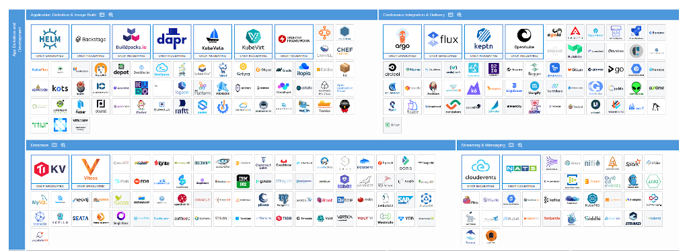
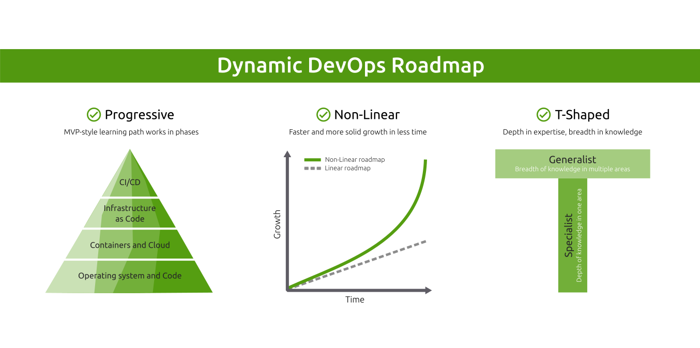
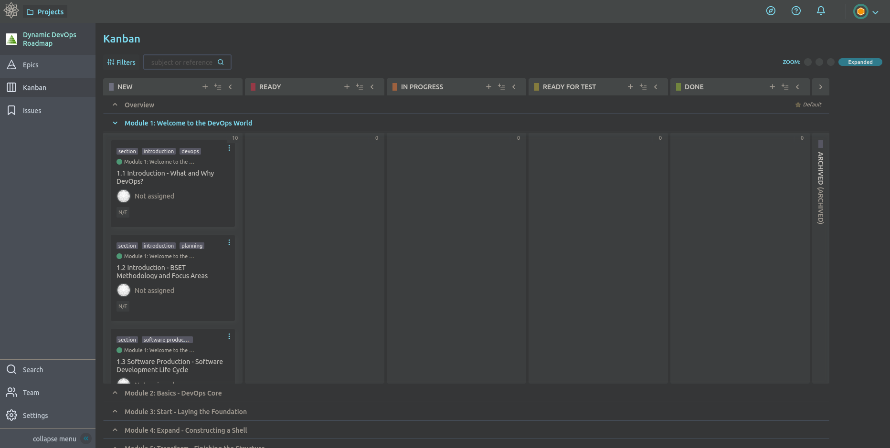

[](https://docs.google.com/forms/d/e/1FAIpQLSfvTweNNgdV26-EnI15dnaJbY6i8X5i3lMjXssUphdrkJ0Sfw/viewform)
[](https://t.me/DevOpsHive)
[](https://github.com/DevOpsHiveHQ/dynamic-devops-roadmap/blob/main/LICENSE)
[](#status)

<!-- omit from toc -->
# Dynamic DevOps Roadmap

<p align="center">
  <a href="https://devopshive.net/" style="display: block; padding: .5em 0; text-align: center;">
    
  </a>
</p>

[DevOps Hive](https://devopshive.net/) master plan for **roadmap**, **mentorship**, and **bootcamp** to start a DevOps Engineer career in the Agile way!

- Visit [](projects/hivebox/README.md)
if you are interested in the DevOps hands-on project only.
- Fill [](https://docs.google.com/forms/d/e/1FAIpQLSfvTweNNgdV26-EnI15dnaJbY6i8X5i3lMjXssUphdrkJ0Sfw/viewform) to register and receive an invitation to the professorial [mentorship](#3-mentorship-program) for **free** (Only **limited slots are available**).
- Join [](https://t.me/DevOpsHive) for discussions and to stay updated (Note: This is a multilingual group).

<!-- omit from toc -->
## Project Badge

Push it forward and add the project badge in your repo to support the community! ⭐

Markdown:

```text
[](https://github.com/DevOpsHiveHQ/dynamic-devops-roadmap)
```

Preview:

[](https://github.com/DevOpsHiveHQ/dynamic-devops-roadmap)

<!-- omit from toc -->
## ToC

- [Status](#status)
- [The Problem](#the-problem)
- [The Solution](#the-solution)
- [Roadmap Modes](#roadmap-modes)
  - [1. Self-Learning Course](#1-self-learning-course)
  - [2. Hands-on Project](#2-hands-on-project)
  - [3. Mentorship Program](#3-mentorship-program)
- [Roadmap Index](#roadmap-index)
  - [Overview](#overview)
  - [Module 1: Welcome to the DevOps World](#module-1-welcome-to-the-devops-world)
  - [Module 2: Basics - DevOps Core](#module-2-basics---devops-core)
  - [Module 3: Start - Laying the Foundation](#module-3-start---laying-the-foundation)
  - [Module 4: Expand - Constructing a Shell](#module-4-expand---constructing-a-shell)
  - [Module 5: Transform - Finishing the Structure](#module-5-transform---finishing-the-structure)
- [License](#license)


## Status

Please note that this repo is still a work in progress.

- **Roadmap Content**: 60%
- **Hands-on Project**: 100%

## The Problem

<p align="center">
  <a href="img/cloud-native-landscape-dec-2023-full.png"imageanchor="1">
    
  </a>
  <br/>
  A subset of the Cloud Native landscape in December 2023 (click for the full landscape)
</p>

<a href="img/devops-roadmap-linear.png" imageanchor="1">
  
</a>

The `DevOps Engineer` role remains one of the top 10 most in-demand jobs across all industries (not just the tech field!). However, starting that role is super challenging because the DevOps model has various patterns and topologies. Also, the Cloud Native landscape keeps expanding, and there is something new every day!

Simply, **you cannot start a DevOps position by merely learning the tools!** It's even more complicated if that's your first job without previous software industry experience (coming from either Dev or Ops).

For that reason, almost every day, I see people struggling on their way to start as fresh/junior DevOps engineers or even progress in their early career years in general. They usually follow some `linear` roadmap like [roadmap.sh/devops](https://roadmap.sh/devops). But still, they cannot land their first job or struggle a lot when they find one! And sadly, many of them eventually give up!

For more details about the problem aspects, please read: [Your DevOps learning roadmap is broken!](https://tech.aabouzaid.com/2023/06/your-devops-learning-roadmap-is-broken.html)


## The Solution

<p align="center">
  <a href="img/dynamic-devops-roadmap.png" imageanchor="1">
    
  </a>
</p>

Based on experience for years mentoring people in different stages (starting their first job, career shift, moving to another work style or company), using a `dynamic MVP-style roadmap` with hands-on projects designed by an experienced DevOps engineer has been highly successful.

That means **first, understanding the problem instead of just learning a bunch of tools** and then **using an iterative style, each iteration will cover most DevOps areas used in the job** to build a T-shaped skills profile from day one! It's also essential to set the targeted market and organizations because, with different DevOps topologies, the DevOps engineer role requirements vary a lot.

## Roadmap Modes

This roadmap is `polymorphic`, which means it's designed to work in different modes. It depends on how fast you want to go.

### 1. Self-Learning Course

This mode is the default and is available for everyone in this repo. In this mode, you are not expected to have DevOps experience, and you want to go from zero to hero, transforming your knowledge to land your first job as a DevOps Engineer.

You just need to follow the roadmap in modules that define the areas you should know as a DevOps Engineer, and provide you with all the resources to learn about them. In this mode, you manage all your learning plans by yourself, and we highly recommend asking a Senior DevOps Engineer (a friend or someone from the community) to review your plans and progress.

<p align="center">
  <a href="#roadmap-index" imageanchor="1">
    ℹ️ Check out the Dynamic Roadmap content ℹ️
  </a>
</p>

### 2. Hands-on Project

In this mode, you already have some experience with DevOps (usually between 1-2 years of work experience), but you want to step up your skills with a real hands-on industry-grad project to learn DevOps in a pragmatic manner. This mode is also available to everyone in this repo.

The project follows the `Learning by Doing` method (aka `Problem-based Learning`) which is done in iterative phases where you learn as you go and cover the whole DevOps cycle like Code, Containers, Testing, Continuous Integration, Continuous Delivery, Observability, and Infrastructure.

<p align="center">
  <a href="projects/hivebox/README.md" imageanchor="1">
    ℹ️ Check out the HiveBox hands-on project ℹ️
  </a>
</p>

> [!NOTE]
> Each phase of this project is tackled gradually, part of the roadmap modules. But it's also **standalone**, and you can work on it if you have the required knowledge for each phase.

### 3. Mentorship Program

This mode covers the previous two modes (that means it could be only for the project or the whole roadmap) but with support from a `mentor`! [DevOps Hive](https://devopshive.net/) will provide you with a DevOps expert who will guide you in following up on your progress and personalizing your learning plan.

A plus point in the mentorship is that you will get access to the roadmap board to utilize Agile methodologies like Epics and Kanban board to implement the plan, incorporating real-world scenarios and best practices, which you will use in a real job when working in an Agile environment.

<p align="center">
  <a href="https://docs.google.com/forms/d/e/1FAIpQLSfvTweNNgdV26-EnI15dnaJbY6i8X5i3lMjXssUphdrkJ0Sfw/viewform" imageanchor="1">
    ℹ️ Register to get access to the Agile board ℹ️
  </a>
  <br/>
</p>

<p align="center">
  
  <br/>
  <br/>
  
</p>


## Roadmap Index

Visit [](projects/hivebox/README.md)
if you are interested in the DevOps hands-on project **only**. Continue if you want the full roadmap.

<p align="center">
  <a href="https://devopshive.net/" style="display: block; padding: 1em 0; text-align: center;">
    
  </a>
</p>

---

### [Overview](./content/00-overview)

- [Introduction](./content/00-overview#introduction)
- [BSET Model and Focus Areas](./content/00-overview#bset-model-and-focus-areas)
- [How to use this roadmap?](./content/00-overview#how-to-use-this-roadmap)

### [Module 1: Welcome to the DevOps World](./content/01-module/)

- [1.1 Introduction - What and Why DevOps?](./content/01-module#11-introduction---what-and-why-devops)
- [1.2 Software Production - Software Development Life Cycle](./content/01-module#12-software-production---software-development-life-cycle)
- [1.3 Software Production - Agile Software Development](./content/01-module#13-software-production---agile-software-development)
- [1.4 Software Production - Change Management and Golden Triangle](./content/01-module#14-software-production---change-management-and-golden-triangle)
- [1.5 DevOps Methodology - DevOps and DevSecOps Core Pillars](./content/01-module#15-devops-methodology---devops-and-devsecops-core-pillars)
- [1.6 DevOps Methodology - DevOps, Cloud, Platform Engineer, and SRE](./content/01-module#16-devops-methodology---devops-cloud-platform-engineer-and-sre)
- [1.7 DevOps Methodology - T-Shaped Skills DevOps Engineer](./content/01-module#17-devops-methodology---t-shaped-skills-devops-engineer)
- [1.8 Project - HiveBox Phase 1](./content/01-module#18-project---hivebox-phase-1)

### [Module 2: Basics - DevOps Core](./content/02-module/)

- [2.1 Code - Python Fundamentals](./content/02-module#21-code---python-fundamentals)
- [2.2 Code - Common Development Tools](./content/02-module#22-code---common-development-tools)
- [2.3 Code - Git Basics](./content/02-module#23-code---git-basics)
- [2.4 Operating System - Linux Fundamentals](./content/02-module#24-operating-system---linux-fundamentals)
- [2.5 Operating System - Common Tools and Commands](./content/02-module#25-operating-system---common-tools-and-commands)
- [2.6 Operating System - Bash Scripting Basics](./content/02-module#26-operating-system---bash-scripting-basics)
- [2.7 Containers - Docker Fundamentals](./content/02-module#27-containers---docker-fundamentals)
- [2.8 Containers - Docker CLI Basics](./content/02-module#28-containers---docker-cli-basics)
- [2.9 Project - HiveBox Phase 2](./content/02-module#29-project---hivebox-phase-2)

### [Module 3: Start - Laying the Foundation](./content/03-module/)

- [3.1 Planning - Define Goals and Requirements](./content/03-module#31-planning---define-goals-and-requirements)
- [3.2 Code - Modularity and Reusability](./content/03-module#32-code---modularity-and-reusability)
- [3.3 Code - Testing and Quality Assurance](./content/03-module#33-code---testing-and-quality-assurance)
- [3.4 Code - Writing Unit Tests](./content/03-module#34-code---writing-unit-tests)
- [3.5 Containers - Docker Best Practices](./content/03-module#35-containers---docker-best-practices)
- [3.6 Continuous Integration - Introduction and Solutions in the Market](./content/03-module#36-continuous-integration---introduction-and-solutions-in-the-market)
- [3.7 Continuous Integration - GitHub Actions Essentials](./main/content/03-module#37-continuous-integration---github-actions-essentials)
- [3.8 Continuous Integration - Pipelines and Quality Gates](./content/03-module#38-continuous-integration---pipelines-and-quality-gates)
- [3.9 Project - HiveBox Phase 3](./content/03-module#39-project---hivebox-phase-3)

### [Module 4: Expand - Constructing a Shell](./content/04-module/)

- [4.1 Planning - Review the Goals and Requirements](./content/04-module#41-planning---review-the-goals-and-requirements)
- [4.2 Code - Twelve-Factor App Methodology](./content/04-module#42-code---twelve-factor-app-methodology)
- [4.3 Code - REST API Best Practices](./content/04-module#43-code---rest-api-best-practices)
- [4.4 Continuous Integration - CI Best Practices](./content/04-module#44-continuous-integration---ci-best-practices)
- [4.5 Containers - Kubernetes Overview and Core Concepts](./content/04-module#45-containers---kubernetes-overview-and-core-concepts)
- [4.6 Observability - Monitoring Application and Infrastructure](./content/04-module#46-observability---monitoring-application-and-infrastructure)
- [4.7 Continuous Delivery - Introduction and Solutions in the Market](./content/04-module#47-continuous-delivery---introduction-and-solutions-in-the-market)
- [4.8 Infrastructure - Cloud Computing and Cloud Native Applications](./content/04-module#48-infrastructure---cloud-computing-and-cloud-native-applications)
- [4.9 Project - HiveBox Phase 4](./content/04-module#49-project---hivebox-phase-4)

### [Module 5: Transform - Finishing the Structure](./content/05-module/)

- [5.1 Planning - Refine the Goals and Requirements](./content/05-module#51-planning---refine-the-goals-and-requirements)
- [5.2 Code - Working with External Systems](./content/05-module#52-code---working-with-external-systems)
- [5.3 Code - Writing Integration Tests](./content/05-module#53-code---writing-integration-tests)
- [5.4 Infrastructure - Infrastructure as Code and Configuration Management](./content/05-module#54-infrastructure---infrastructure-as-code-and-configuration-management)
- [5.5 Infrastructure - Terraform Essentials](./content/05-module#55-infrastructure---terraform-essentials)
- [5.6 Containers - Kubernetes Configuration Management](./content/05-module#56-containers---kubernetes-configuration-management)
- [5.7 Observability - Log Aggregation Systems](./content/05-module#57-observability---log-aggregation-systems)
- 5.8 Continuous Delivery - CD Best Practices
- 5.9 Project - HiveBox Phase 5

[**Module 6: Keep Improving**](./content/06-module/)

- 6.1 Planning - Agile Retrospective
- 6.2 Code - Performance Optimizations
- 6.3 Continuous Integration - Software Supply Chain Security
- 6.4 Infrastructure - Multi-environment Architecture
- 6.5 Containers - Kubernetes Operators
- 6.6 Continuous Delivery - End-to-End Release Automation
- 6.7 Continuous Deployment - Introduction and Solutions in the Market
- 6.8 Continuous Deployment - GitOps and Argo CD Essentials
- 6.9 Project - HiveBox Phase 6

[**Module 7: Capstone Project**](./content/07-module/)

- 7.1 Requirements
- 7.2 Plan
- 7.3 Implementation
- 7.4 Review

[**Next Steps**](./content/08-next-steps)

- Review - Write Your CV and Cover Letter
- Review - Build Your Skills   Radar Chart
- Discussion - DevOps Certificates
- Discussion - Next Steps as a DevOps Engineer

## License

This project is by [DevOps Hive](https://devopshive.net/) and licensed under the open-source license, [Creative Commons  Attribution-ShareAlike 4.0 International](https://creativecommons.org/licenses/by-sa/4.0/). For more details, please review [LICENSE](LICENSE).
